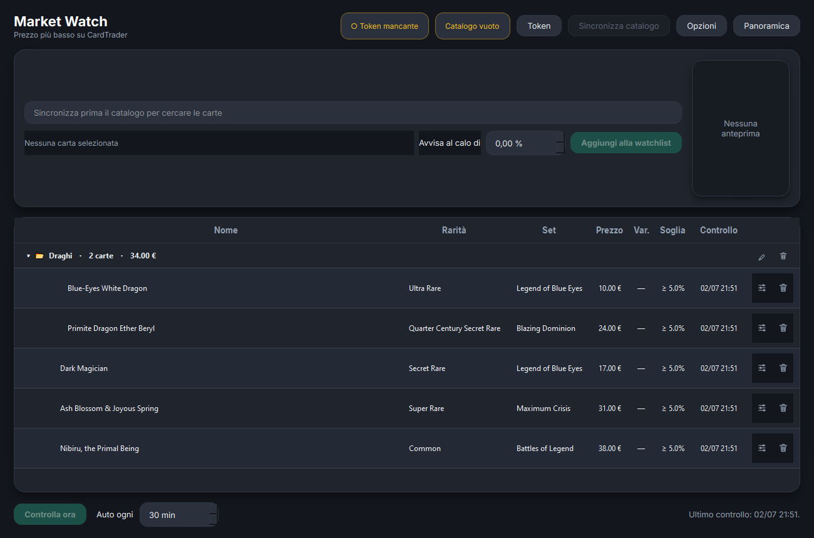
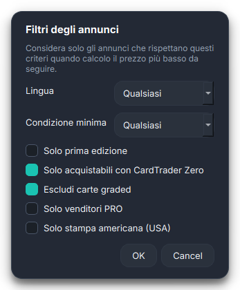

# YGO Toolbox

Cassetta degli attrezzi **modulare** per Yu-Gi-Oh! con interfaccia desktop
(PySide6/Qt, tema scuro). Ogni funzionalità è un modulo indipendente: se ne
aggiunge una creando una cartella, senza toccare il resto.

Primo modulo: **Market Watch** — segue il **prezzo più basso reale su
CardTrader** (API ufficiale) e manda una notifica di sistema quando il prezzo
cala oltre la soglia che decidi tu.



## Funzionalità

- **Catalogo completo** (~48.000 stampe Yu-Gi-Oh!) con immagini, rarità e
  codici set; **ricerca live "a token"** (parole parziali in qualsiasi ordine
  su nome + rarità + codice set)
- **Watchlist** con soglia di calo personalizzata, controllo manuale,
  periodico e **automatico all'avvio**; variazione % calcolata dall'ultimo
  *cambio* di prezzo
- **Cartelle espandibili** con drag & drop, conteggio e totale €
- **Filtri sugli annunci** globali e per singola carta: lingua, condizione
  minima, prima edizione, CardTrader Zero, escludi graded, solo venditori
  PRO, euristica "stampa americana"
- **Modalità Panoramica**: watchlist estesa con condizione, lingua, 1ª ed.,
  Zero, venditore (con bandierina del paese e badge PRO), commenti e quantità
- **Badge disegnati a runtime** (zero asset): rarità in stile foil
  (UR, ScR, QCSR, …), pill dei codici set, bandierine di ~38 paesi
- **UI adattiva**: tutta l'interfaccia scala con la finestra; in Panoramica
  la densità si adatta perché stia sempre tutto a schermo
- **Impostazioni "in-app"** (card senza cornice di Windows, chiudi = applica),
  interruttori animati, animazioni disattivabili, **Italiano/English**
- Persistenza completa: la watchlist è già piena al riavvio, con l'ultimo
  annuncio visto per ogni carta



## Avvio rapido (da sorgente)

```bash
git clone <questo-repo>
cd ygo_toolbox
python -m venv .venv
.venv\Scripts\activate           # Linux/macOS: source .venv/bin/activate
pip install -r requirements.txt
python main.py
```

Al primo avvio: imposta il tuo **token CardTrader** (pulsante con la chiave;
si crea gratis su cardtrader.com, sezione API del profilo) e **sincronizza il
catalogo** (~5 minuti, una tantum). I dati (token, watchlist, storico) stanno
in `~/.ygo_toolbox/`, fuori dal repository.

### Test (headless, senza rete)

```bash
QT_QPA_PLATFORM=offscreen python tests/smoke_test.py
```

### Eseguibile Windows

```bash
pip install pyinstaller pillow
pyinstaller --noconfirm ygo_toolbox.spec
# → dist/YGO Toolbox.exe (con --clean se cambi l'icona)
```

## Architettura (per estenderlo)

```
ygo_toolbox/
├── main.py                          # avvio (+ log dell'exe, lingua)
├── core/                            # motore, agnostico dai moduli
│   ├── app.py                       # finestra, sidebar, scala UI
│   ├── module_base.py               # contratto ToolModule
│   ├── module_loader.py             # scoperta automatica dei moduli
│   ├── context.py                   # servizi condivisi (storage, notifiche)
│   ├── storage.py                   # wrapper SQLite (solo thread GUI)
│   ├── theme.py                     # tema scuro/teal (QSS scalabile, Inter)
│   ├── anim.py                      # animazioni (disattivabili globalmente)
│   └── i18n.py                      # traduzioni (it di default, en)
└── modules/
    └── market_watch/
        ├── module.py                # aggancio ToolModule
        ├── widget.py                # interfaccia + logica
        ├── repository.py            # watchlist, cartelle, storico, catalogo
        ├── filters_dialog.py        # dialoghi in-app (filtri, opzioni)
        ├── search_model.py          # popup di ricerca con miniature
        ├── flags.py / rarity.py     # bandierine e badge rarità (QPainter)
        ├── workers.py               # rete in QThread (mai DB dai thread)
        └── providers/               # FONTI DI PREZZO INTERCAMBIABILI
            ├── base.py              # contratto PriceProvider
            └── cardtrader.py        # implementazione CardTrader
```

**Nuovo modulo**: crea `modules/<nome>/module.py` con una sottoclasse di
`ToolModule` (`id`, `title`, `create_widget`) — al riavvio compare da solo
nel menu. **Nuova fonte di prezzo** (es. CardMarket): una classe in
`providers/` che implementa `search_cards` e `lowest_price`; il resto del
modulo non cambia.

Riferimenti di sviluppo: [REGISTRO.md](REGISTRO.md) (lato utente) e
[REGISTRO_TECNICO.md](REGISTRO_TECNICO.md) (architettura, decisioni, gotchas).

## Note

- Serve un account CardTrader (gratuito) per il token API — ognuno usa il suo.
- Niente richieste a raffica: l'API è dietro Cloudflare e i rate limit sono
  reali. La sincronizzazione del catalogo è l'unica operazione pesante.
- Il font [Inter](https://rsms.me/inter/) è incorporato (licenza OFL, in
  `assets/fonts/`).
